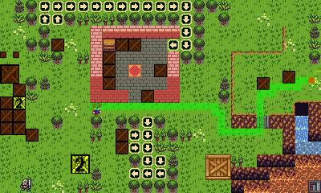

# Grid Physics for Phaser

The Grid Physics plugin is to Arcade physics what Arcade physics is to Box2D. :-) This plugin adds support for grid/tile based movement along with some other stuff to make your life easier if you choose the path of grid restricted movement. My aim is to build the API as close as possible to Arcade physics.

**Status:** The development is put on hold and will be ported to Phaser 3 when it's released. My plan is to create a RPG with the plugin and I prefer a delay over being stuck with Phaser 2. (Don't get me wrong. Phaser 2 is great but for a long-term project I prefer to wait.) **However:** the plugin will work great for a lot of projects in it's present form (read the "known annoyning bugs"-section). I will also accept PRs.

**Setup instructions** is in the end of this file.

**Demo** is hosted here: http://metroid.niklasberg.se/gridPhysics/

**Discuss** by submitting issues here or on html5gamedevs.com: http://www.html5gamedevs.com/topic/28051-grid-physics-plugin/


<br>
*Screenshot of the demo with path debugging enabled. The border of hill to the right is an example of tiles that is internally blocked.*

## Credits
* @Samme for creating the brunch build configuration!
* Project is based on Phaser-ES6-Webpack by Leandro Cabrera: https://github.com/lean/phaser-es6-webpack
* Tileset and sprites: Dawnlike by DragonDePlatino, DawnBringer. http://opengameart.org/content/dawnlike-16x16-universal-rogue-like-tileset-v181
* Hero sprite by Gazer: http://opengameart.org/content/overhead-action-rpg-characters
* I don't remember the source for the box graphics.

## Current state of the plugin
Please note that the plugin is not suitable for production use yet. Buildning stand-alone plugin is not yet working, but you can import the source files into your project as long you have something set up that support imports and ES6/2005. The API is not set in stone. Ideas are added randomly, and probably not in the smartest way from start. The demo is based on a prototype for a game and will need to be replaced or reworked. The code needs to be cleaned up. A lot of comments are in Swedish, and the source is largely uncommented. *Anyway:* I added it to Github to allow others to try it, and to invite anyone interested to contribute.


## This plugin vs a quick custom solution
Grid based movement isn't very complicated (Move your sprite one step to the right: "sprite.x+=gridUnitWidth"). The purpose with this plugin is to do this in a stable way, allowing animations without resorting to tweens, collision detection, one-way-tiles, movable objects, turn-based time, path finding and loads of methods and properties tied to the grid physics body. It will be an asset for anyone doing a RPG, puzzle games (like "The adventures of Lolo" on NES or Sokoban), retro action rpg (like "Zelda" on NES), rouge like games, retro platformers (like Castlequest on MSX (minus gravity for now)) strategy and board games.

## Features
* Any grid size  (not necessarily squares, i.e. 8x16 is possible, and not restricted to sprite or tile sizes).
* Turn-based or real-time.
* Visual debugging
* *Tilemap:*
   * Tile dimensions may differ from grid dimensions (but needs to be multiple of the grid dimensions, like 16x16 tiles on an 8x8 grid).
   * Collision detection against tiles with callback.
   * Tile collisions on specified directions only
   * Tile collision: Block against leaving tile in any direction.
* *Bodies (sprites):*
   * Body size is not restricted to grid-size, and different body sizes may co-exist (but must be equal or a multiple of grid dimensions. The sprite graphics may differ from body size.)
   * Path finding (requires easystar.js)
   * Moveable objects (can be chained, i.e. the player push one crate against another crate that will also move).
   * Mass (and strength that limit total mass that can be pushed by the power of one sprite)
   * Velocity, ("struggle" property that can slow down a body based on mass pushed)
   * Populated properties like isMoving.x (boolean) or isBlocked.top (boolean).

## Code examples (expect changes)
* Init 8x8 grid physics:
```javascript
this.game.plugins.add(new GridPhysics(this.game));
game.physics.gridPhysics.gridSize.set(8);
```

* Enable grid collision on a tile map layer:
```javascript
game.physics.gridPhysics.enable(layer);
```

* Enable grid body on sprite:
```javascript
game.physics.gridPhysics.enable(sprite);
```

* Try to move a sprite to the right with 50px/s (collision detection with all solid objects and tilemaps is built-in):
```javascript
sprite.body.setVelocity(50, 0);
```

## Known annoying bugs
* Pushing already moving bodies might cause unexpected results.
* Pathfinding still struggles with one-way-tiles (but not always).
* Tiles with internal blocks isn't compatible with current pathfinding implementation.
* Turn-based time wont work with more than two entities. :-O

## Future features
Depending on the interest I may add extra features. Some of the features is quick-fixes that I just typed down to remember them, others will be a bit more challenging. Possible ideas in no particular order:

* *Tilemap:*
   * Ground types: Slippery, slowdown (factor), moving
   * getPath(x,y,x2,y2)
   * noExitTop (etc) - As collide but prevent from leaving a tile in a direction.
* *Body:*
   * setGridPosition
   * Gestures: Jump, Shake etc.
   * movement.slide - Slide around corners to prevent getting stuck (pressing up with a character with the top right part of the body blocked will result in sliding to the left if it would be possible to walk up in the next step)
   * movement.ZeldaNESMovement - "Free movement" that adjusts the body to a the grid.
   * movement.turn - Allow to turn back in the opposite direction before finishing the ongoing move.
   * movement.margin - Allow new turn when the margin in pixels is left of the last one (default = 0)
   * Callback on collision to bodies and tiles, possibility to cancel collision.
   * standingOn - An array of tiles the body is standing on
   * blocked.dir
   * pushque.dir (oavsett om orkar)
   * Particle collision
   * Arcade-like movements (bullets, random vector)
   * Moving platforms
   * Drag
   * Magnetism
   * Conjoined bodies
   * Gravity.x/y
   * Pause
   * MoveCountToXY - numbers of moves necessarily (using pathfinding)
   * JumpToXY - Move to XY without collision detection
   * NextPossible - Move to next free space in given direction.
   * Body.onCollide, stopVelocityOnCollide
   * Support for non-linear velocities (like tweens)
   * Properties: blocked.left/right/up/down, isMoving, isPushing, massPushed
   * Trying to go x,y simulanously - If x wont work, try y.
   * forcedMovement (being pushed overrides the the desired velocioty of the object)


## Getting started:

**Clone this repo:**<br>
Navigate into your workspace directory.
Run:
`git clone https://github.com/nkholski/phaser-grid-physics`

**Install dependencies (if you don't have them):**
* [Node.js](http://nodejs.org): `brew install node` on OS X
* [Brunch](http://brunch.io): `npm install -g brunch`
* Brunch plugins and app dependencies: `npm install`

**Running the demo:**<br>
`brunch watch --server` — watches the project with continuous rebuild. This will also launch HTTP server with [pushState](https://developer.mozilla.org/en-US/docs/Web/Guide/API/DOM/Manipulating_the_browser_history). The local url will be http://localhost:3333/demo/

**Building the plugin (and demo):**<br>
`brunch build --production` — builds minified project for production in the dist folder, both the demo and the plugin. The filename of the plugin is "gridPhysics.js".

## API Documentation
Not yet. To much is in flux.
